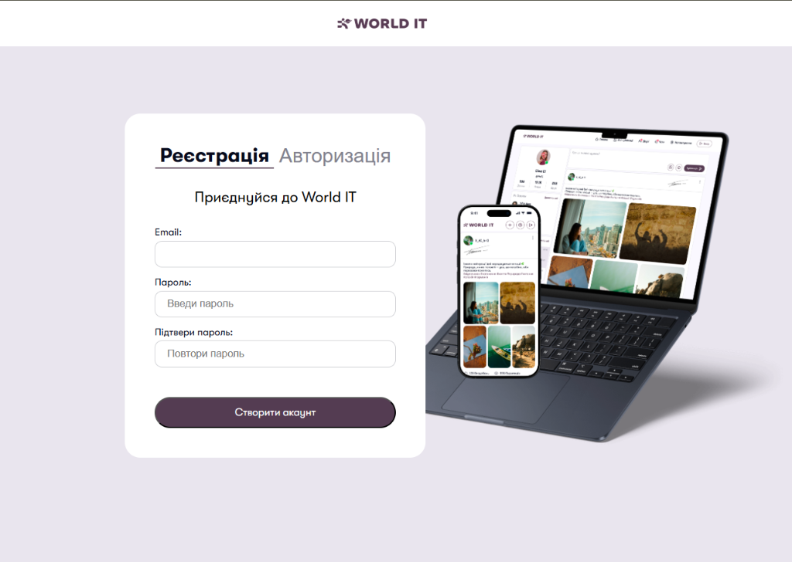
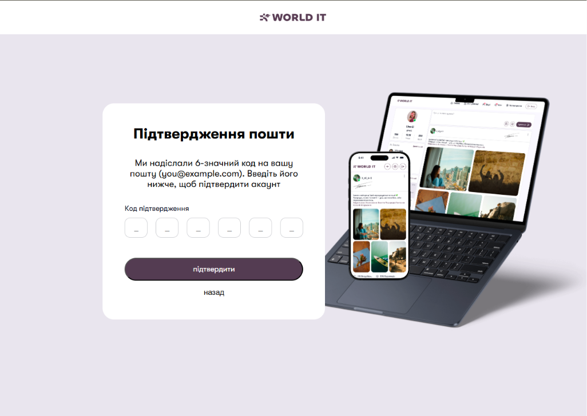
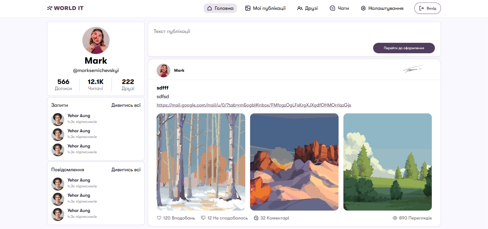
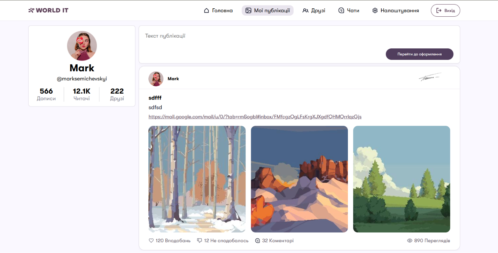
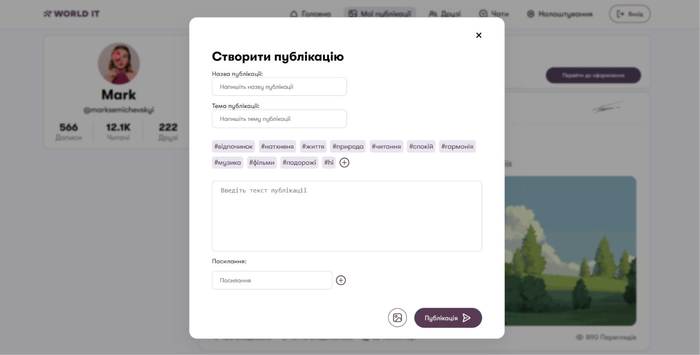
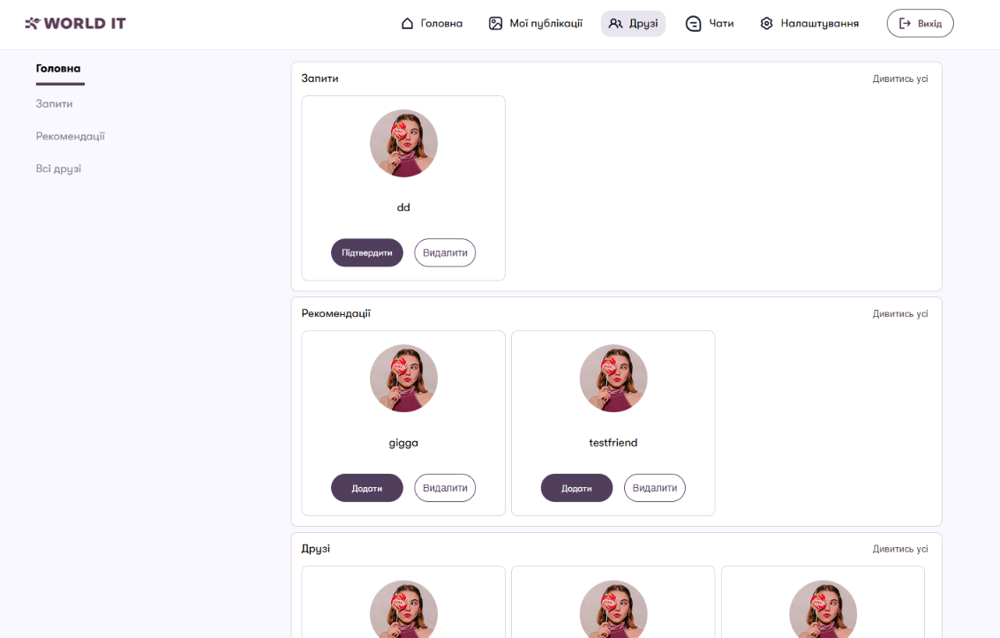
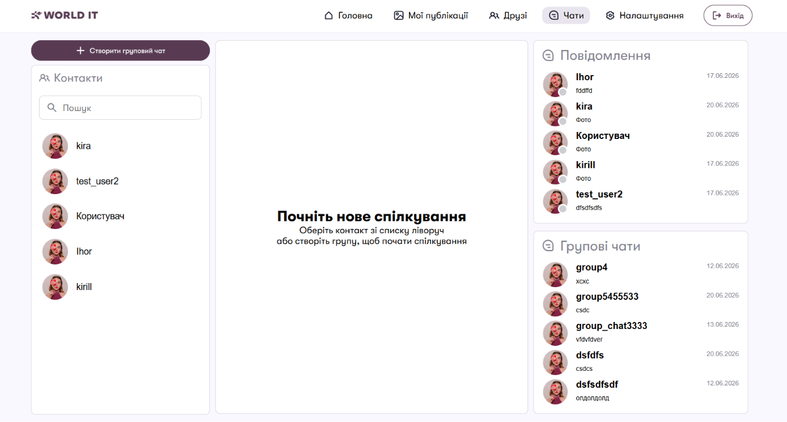
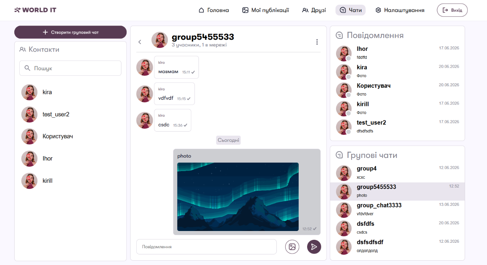
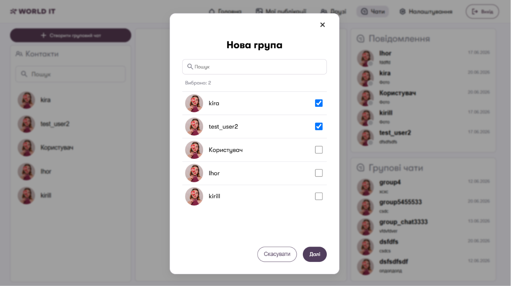
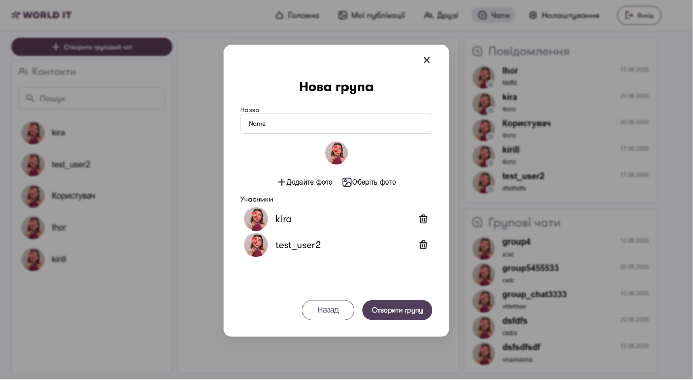

# Social Network Project / Проєкт Соціальна Мережа

## Language / Вибір мови
* [English Version](#english-version)
* [Українська версія](#українська-версія)

---

## English Version

### Table of Contents
1. [Project Purpose](#1-project-purpose)
2. [Modules and Technologies](#2-modules-and-technologies)
3. [How to Run the Project](#3-how-to-run-the-project)
4. [Project Content and Structure](#4-project-content-and-structure)
5. [Conclusion and Key Learnings](#5-conclusion-and-key-learnings)
6. [Team Members](#6-team-members)

### 1. Project Purpose
The primary goal of this project is to build a modern, scalable, real-time social networking platform from scratch. For a beginner developer, this project serves as an excellent comprehensive guide and practical blueprint that demonstrates:
* How to combine synchronous web requests (Django) with asynchronous features (WebSockets via Channels).
* How to architecture a multi-component application with real-time user interaction, persistent data storage, and media handling.
* How to write clean, modular JavaScript to dynamically update the DOM without full page reloads.

### 2. Modules and Technologies
* **Backend:** Django (Core framework managing MVC architecture, ORM, and authentication).
* **Asynchronous Server & Protocols:** Django Channels & Daphne (Enabling WebSockets for real-time capabilities).
* **Frontend:** HTML5, CSS3, JavaScript (Native asynchronous DOM manipulation and WebSocket clients).
* **Media Processing:** Pillow (Handling post and chat images, image uploads, and dynamic scaling).
* **Email Services:** Django Sendmail / SMTP configurations (For account verifications).

### 3. How to Run the Project
Follow these steps to set up and run the project locally:
### 1. Configure settings.py
1. **Create .env file**
In the root of the project (next to `manage.py`), create a file called `.env` and copy the following settings there:

    ```python
    # Generate a unique secret key for your project. Do not share it in production!
    SECRET_KEY="your-custom-django-secret-key-here"
    DEBUG=True

    # Set to 'sqlite' for local development or 'postgresql' for production/remote server
    DATABASE_TYPE="sqlite"

    # SSH Tunnel Configuration (Required only if DATABASE_TYPE="postgresql")
    SSH_HOST="ssh.pythonanywhere.com"
    SSH_PORT="22"
    SSH_USER="your_ssh_username"
    SSH_PASSWORD="your_ssh_password"

    # Remote PostgreSQL Host Boundaries
    DB_REMOTE_HOST="your-database-services.com"
    DB_REMOTE_PORT="15274"
    DB_LOCAL_HOST="127.0.0.1"
    DB_LOCAL_PORT="5435"

    # PostgreSQL Service Credentials
    DB_NAME="your_db_name"
    DB_USER="your_db_user"
    DB_PASSWORD="your_db_password"

    # To use Gmail, you must enable 2FA on your Google account and generate an "App Password"
    EMAIL_HOST_USER="your_email@gmail.com"
    EMAIL_HOST_PASSWORD="your_16_digit_app_password"
    ```


### 2. Bash terminal commands
After you finished configuring settings.py open bash terminal
1. **Clone the repository:**
   ```bash
   git clone <repository-url>
   cd <repository-directory>

   (or install .zip)

2. **Create and activate a virtual environment:**
    ```bash
    # Windows
    python -m venv venv
    source venv/scripts/activate

    # Linux/macOS
    python3 -m venv venv
    source venv/bin/activate

3. **Install dependencies:**
    ```bash
    # Windows
    pip install -r requirements.txt

    # Linux/macOS
    pip3 install -r requirements.txt

4. **Move to social_network:**
    ```bash

    cd social_network
    (your path should be: '/social_network/social_network')

5. **Apply database migrations (if using local database):**
    ```bash
    # Windows
    python manage.py makemigrations
    python manage.py migrate

    # Linux/macOS
    python3 manage.py makemigrations
    python3 manage.py migrate

6. **Start the development server (via Daphne/Channels):**
    ```bash
    # Windows
    python manage.py runserver

    # Linux/macOS
    python3 manage.py runserver

### 4. Project Content and Structure
Here is an overview of the core applications included in this ecosystem:

### 1. user_app and profile_app: Authentication & User Profiles
* Manages secure registration using email confirmation, login, logout, profile customization (pseudonym, username), and friendship between users.
Preview:

<table>
  <tr>
    <td width="50%" align="center"><b>Registration page</b></td>
    <td width="50%" align="center"><b>Email confirmation page</b></td>
  </tr>
  <tr>
    <td></td>
    <td></td>
  </tr>
</table>


### 2. main_app: Main page & posts
* Main page of the website, displays all existing posts using pagination, allows creating posts

Preview:

<table>
  <tr>
    <td width="50%" align="center"><b>Main page</b></td>
  </tr>
  <tr>
    <td align="center"></td>
  </tr>
</table>

### 3. post_app: View and create user posts
* Create your posts

Preview:

<table>
  <tr>
    <td width="50%" align="center"><b>Post page</b></td>
    <td width="50%" align="center"><b>Post creation form</b></td>
  </tr>
  <tr>
    <td></td>
    <td></td>
  </tr>
</table>

### 4. friends_app: Manage friends
* Add friends, send friendship requests and view their profile(post page)

Preview:

<table>
  <tr>
    <td width="50%" align="center"><b>Friends page</b></td>
  </tr>
  <tr>
    <td align="center"></td>
  </tr>
</table>

### 5. chat_app: Chat with your friends
* Create chats, manage groups, send and recieve messages and photos

Preview:

<table>
  <tr>
    <td width="25%" align="center"><b>Chat page</b></td>
    <td width="25%" align="center"><b>Chat preview</b></td>

  </tr>
  <tr>
    <td></td>
    <td></td>

  </tr>
</table>

<table>
  <tr>
    <td width="25%" align="center"><b>Create group 1</b></td>
    <td width="25%" align="center"><b>Create group 2</b></td>
  </tr>
  <tr>
    <td></td>
    <td></td>
  </tr>
</table>

### 5. Conclusion and Key Learnings
* Building this social network allowed us to master advanced backend concepts such as event-driven architecture, connection state management, and real-time data flow. We successfully integrated asynchronous layers into a standard synchronous framework.

* Future development paths include adding full End-to-End Encryption (E2EE) for chats and introducing video/audio streaming.


### 6. Team members
* **Mark Semichevskyi - https://github.com/marksemichevskyi**
* **Kirill Varyzhuk - https://github.com/Kirill213-wq**
* **Ihor - https://github.com/Ihor1020**


## Українська Версія

### Зміст
1. [Мета створення проєкту](#1-мета-створення-проєкту)
2. [Модулі та технології](#2-модулі-та-технології)
3. [Як запустити проєкт в роботу](#3-як-запустити-проєкт-в-роботу)
4. [Зміст проєкту](#4-зміст-проєкту)
5. [Висновок по роботі](#5-висновок-по-роботі)
6. [Склад команди](#6-склад-команди)

### 1. Мета створення проєкту
Головною метою цього проєкту є створення з нуля сучасної, масштабованої платформи соціальних мереж, що працює в режимі реального часу. Для розробника-початківця цей проєкт слугує чудовим посібником та практичним планом, який демонструє:
* Як поєднати синхронні веб-запити (Django) з асинхронними функціями (WebSockets через channels).
* Як створити архітектуру багатокомпонентного застосунку з взаємодією з користувачем у режимі реального часу, постійним сховищем даних та обробкою медіа.
* Як написати чистий, модульний JavaScript для динамічного оновлення DOM без повного перезавантаження сторінки.

### 2. Модулі та технології
* **Бекенд:** Django (основний фреймворк, що керує архітектурою MVC, ORM та автентифікацією).
* **Асинхронний сервер і протоколи:** Django Channels & Daphne (увімкнення WebSockets для роботи в режимі реального часу).
* **Фронтенд:** HTML5, CSS3, JavaScript (нативна асинхронна маніпуляція DOM та клієнтами WebSocket).
* **Обробка медіа:** Pillow (обробка зображеннь для чатів та постів, завантаження зображень та динамічне масштабування).
* **Сервіси електронної пошти:** Конфігурації Django Sendmail / SMTP (для перевірки облікових записів).

### 3. Як запустити проєкт в роботу
Виконайте ці кроки, щоб налаштувати та запустити проект локально:
### 1. Налаштуйте settings.py
1. **Створіть файл .env**
У кореневому каталозі проекту (поруч із `manage.py`) створіть файл з назвою `.env` та скопіюйте туди такі налаштування:

    ```python
    # Згенеруйте унікальний секретний ключ для вашого проєкту. Не поширюйте його в продакшені!
    SECRET_KEY="your-custom-django-secret-key-here"
    DEBUG=True

    # Встановіть значення «sqlite» для локальної розробки або «postgresql» для виробничої/віддаленої серверної версії
    DATABASE_TYPE="sqlite"

    # Конфігурація тунелю SSH (обов'язкова, лише якщо DATABASE_TYPE="postgresql")
    SSH_HOST="ssh.pythonanywhere.com"
    SSH_PORT="22"
    SSH_USER="your_ssh_username"
    SSH_PASSWORD="your_ssh_password"

    # Межі віддаленого хоста PostgreSQL
    DB_REMOTE_HOST="your-database-services.com"
    DB_REMOTE_PORT="15274"
    DB_LOCAL_HOST="127.0.0.1"
    DB_LOCAL_PORT="5435"

    # Облікові дані служби PostgreSQL
    DB_NAME="your_db_name"
    DB_USER="your_db_user"
    DB_PASSWORD="your_db_password"

    # Щоб користуватися Gmail, потрібно ввімкнути двофакторну аутентифікацію (2FA) у своєму обліковому записі Google та створити «Пароль програми»
    EMAIL_HOST_USER="your_email@gmail.com"
    EMAIL_HOST_PASSWORD="your_16_digit_app_password"
    ```

### 2. Bash terminal commands
Після налаштування settings.py відкрийте bash термінал
1. **Клонуйте рипозиторій:**
   ```bash
   git clone <repository-url>
   cd <repository-directory>

   (або завантажте .zip)

2. **Створіть та активуйте віртуальне середовище:**
    ```bash
    # Windows
    python -m venv venv
    source venv/scripts/activate

    # Linux/macOS
    python3 -m venv venv
    source venv/bin/activate

3. **Встановіть потрібні модулі**
    ```bash
    # Windows
    pip install -r requirements.txt

    # Linux/macOS
    pip3 install -r requirements.txt

4. **Перейдіть до /scial_network**
    ```bash

    cd social_network
    (your path should be: '/social_network/social_network')

5. **Застосуйте міграції бази даних (якщо використовується локальна база даних):**
    ```bash
    # Windows
    python manage.py makemigrations
    python manage.py migrate

    # Linux/macOS
    python3 manage.py makemigrations
    python3 manage.py migrate

6. **Запустіть сервер розробки (через Daphne/Channels):**
    ```bash
    # Windows
    python manage.py runserver

    # Linux/macOS
    python3 manage.py runserver

### 4. Зміст проєкту
Ось огляд основних програм, що входять до цієї екосистеми:

### 1. user_app та profile_app: Автентифікація та профілі користувачів
* Керує безпечною реєстрацією за допомогою підтвердження електронною поштою, входу, виходу, налаштування профілю (псевдонім, ім'я користувача) та дружби між користувачами.

Огляд:

<table>
  <tr>
    <td width="50%" align="center"><b>Registration page</b></td>
    <td width="50%" align="center"><b>Email confirmation page</b></td>
  </tr>
  <tr>
    <td></td>
    <td></td>
  </tr>
</table>


### 2. main_app: Головна сторінка та пости
* Головна сторінка вебсайту, відображає всі існуючі публікації з використанням пагінації, дозволяє створювати публікації

Огляд:

<table>
  <tr>
    <td width="50%" align="center"><b>Main page</b></td>
  </tr>
  <tr>
    <td align="center"></td>
  </tr>
</table>

### 3. post_app: Перегляд та створення публікацій користувачів
* Створюйте власні пости

Огляд:

<table>
  <tr>
    <td width="50%" align="center"><b>Post page</b></td>
    <td width="50%" align="center"><b>Post creation form</b></td>
  </tr>
  <tr>
    <td></td>
    <td></td>
  </tr>
</table>

### 4. friends_app: Керування друзями
* Додавайте друзів, надсилайте запити на дружбу та переглядайте їхні профілі (сторінку публікацій)

Огляд:

<table>
  <tr>
    <td width="50%" align="center"><b>Friends page</b></td>
  </tr>
  <tr>
    <td align="center"></td>
  </tr>
</table>

### 5. chat_app: Спілкуйтеся з друзями
* Створюйте чати, керуйте групами, надсилайте та отримуйте повідомлення та фотографії

Огляд:

<table>
  <tr>
    <td width="25%" align="center"><b>Chat page</b></td>
    <td width="25%" align="center"><b>Chat preview</b></td>

  </tr>
  <tr>
    <td></td>
    <td></td>

  </tr>
</table>

<table>
  <tr>
    <td width="25%" align="center"><b>Create group 1</b></td>
    <td width="25%" align="center"><b>Create group 2</b></td>
  </tr>
  <tr>
    <td></td>
    <td></td>
  </tr>
</table>

### 5. Висновок по роботі
* Створення цієї соціальної мережі дозволило нам опанувати передові концепції бекенду, такі як архітектура, керована подіями, керування станом з'єднання та потік даних у режимі реального часу. Ми успішно інтегрували асинхронні шари у стандартний синхронний фреймворк.

* Майбутні шляхи розвитку включають додавання повного наскрізного шифрування (E2EE) для чатів та впровадження потокового відео/аудіо


### 6. Склад команди
* **Mark Semichevskyi - https://github.com/marksemichevskyi**
* **Kirill Varyzhuk - https://github.com/Kirill213-wq**
* **Ihor - https://github.com/Ihor1020**